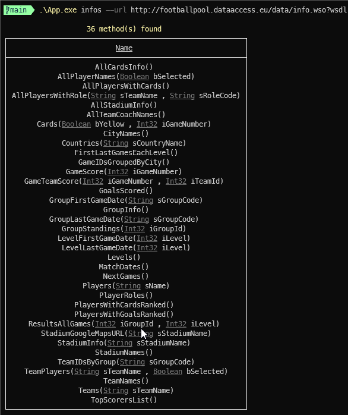

[](https://github.com/aimenux/DynamicSoapProxyDemo/actions/workflows/ci.yml)

# DynamicSoapProxyDemo
```
Invoking dynamically a soap web service
```

> In this repo, i m providing a set of helpers in order to generate a dynamic proxy useful for calling soap web services (i.e. [DataFlex Web Service](https://ws.footballpool.dataaccess.eu/info.wso))
>
> 
>

**`Tools`** : vs22, net framework 4.8, mapster, mstest, fluent-assertions
